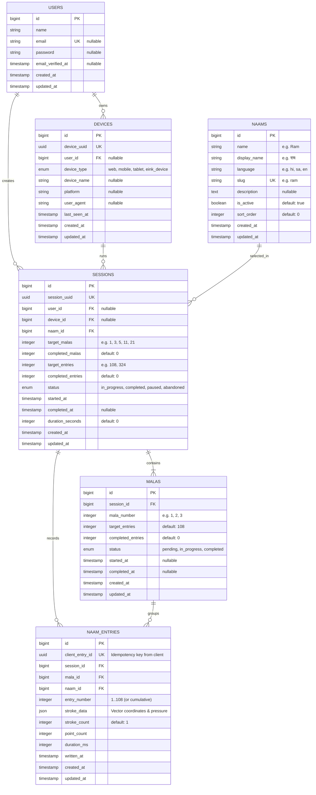

# Harinaam — Database Schema & Data Modeling

## 1. Entity-Relationship Diagram



---

## 2. Table Specifications

### 2.1 `users`
Supports registered users while keeping writing accessible for anonymous guest/device users.
```sql
CREATE TABLE `users` (
  `id` BIGINT UNSIGNED NOT NULL AUTO_INCREMENT,
  `name` VARCHAR(255) NOT NULL,
  `email` VARCHAR(255) NULL UNIQUE,
  `password` VARCHAR(255) NULL,
  `email_verified_at` TIMESTAMP NULL,
  `remember_token` VARCHAR(100) NULL,
  `created_at` TIMESTAMP NULL,
  `updated_at` TIMESTAMP NULL,
  PRIMARY KEY (`id`)
) ENGINE=InnoDB DEFAULT CHARSET=utf8mb4 COLLATE=utf8mb4_unicode_ci;
```

---

### 2.2 `devices`
Tracks hardware devices (browsers, tablets, or dedicated digital slate hardware).
```sql
CREATE TABLE `devices` (
  `id` BIGINT UNSIGNED NOT NULL AUTO_INCREMENT,
  `device_uuid` CHAR(36) NOT NULL UNIQUE,
  `user_id` BIGINT UNSIGNED NULL,
  `device_type` ENUM('web', 'mobile', 'tablet', 'eink_device') NOT NULL DEFAULT 'web',
  `device_name` VARCHAR(255) NULL,
  `platform` VARCHAR(100) NULL,
  `user_agent` TEXT NULL,
  `last_seen_at` TIMESTAMP NULL,
  `created_at` TIMESTAMP NULL,
  `updated_at` TIMESTAMP NULL,
  PRIMARY KEY (`id`),
  KEY `devices_user_id_foreign` (`user_id`),
  CONSTRAINT `devices_user_id_foreign` FOREIGN KEY (`user_id`) REFERENCES `users` (`id`) ON DELETE SET NULL
) ENGINE=InnoDB DEFAULT CHARSET=utf8mb4 COLLATE=utf8mb4_unicode_ci;
```

---

### 2.3 `naams`
Stores sacred names available for selection.
```sql
CREATE TABLE `naams` (
  `id` BIGINT UNSIGNED NOT NULL AUTO_INCREMENT,
  `name` VARCHAR(100) NOT NULL,
  `display_name` VARCHAR(100) NOT NULL,
  `language` VARCHAR(10) NOT NULL DEFAULT 'hi',
  `slug` VARCHAR(100) NOT NULL UNIQUE,
  `description` TEXT NULL,
  `is_active` TINYINT(1) NOT NULL DEFAULT 1,
  `sort_order` INT NOT NULL DEFAULT 0,
  `created_at` TIMESTAMP NULL,
  `updated_at` TIMESTAMP NULL,
  PRIMARY KEY (`id`),
  KEY `naams_is_active_sort_order_index` (`is_active`, `sort_order`)
) ENGINE=InnoDB DEFAULT CHARSET=utf8mb4 COLLATE=utf8mb4_unicode_ci;
```

---

### 2.4 `sessions`
Represents a continuous Naam Lekhan practice sitting.
```sql
CREATE TABLE `sessions` (
  `id` BIGINT UNSIGNED NOT NULL AUTO_INCREMENT,
  `session_uuid` CHAR(36) NOT NULL UNIQUE,
  `user_id` BIGINT UNSIGNED NULL,
  `device_id` BIGINT UNSIGNED NULL,
  `naam_id` BIGINT UNSIGNED NOT NULL,
  `target_malas` INT UNSIGNED NOT NULL DEFAULT 1,
  `completed_malas` INT UNSIGNED NOT NULL DEFAULT 0,
  `target_entries` INT UNSIGNED NOT NULL DEFAULT 108,
  `completed_entries` INT UNSIGNED NOT NULL DEFAULT 0,
  `status` ENUM('in_progress', 'completed', 'paused', 'abandoned') NOT NULL DEFAULT 'in_progress',
  `started_at` TIMESTAMP NOT NULL DEFAULT CURRENT_TIMESTAMP,
  `completed_at` TIMESTAMP NULL,
  `duration_seconds` INT UNSIGNED NOT NULL DEFAULT 0,
  `created_at` TIMESTAMP NULL,
  `updated_at` TIMESTAMP NULL,
  PRIMARY KEY (`id`),
  KEY `sessions_user_id_index` (`user_id`),
  KEY `sessions_device_id_index` (`device_id`),
  KEY `sessions_naam_id_foreign` (`naam_id`),
  KEY `sessions_status_index` (`status`),
  CONSTRAINT `sessions_user_id_foreign` FOREIGN KEY (`user_id`) REFERENCES `users` (`id`) ON DELETE SET NULL,
  CONSTRAINT `sessions_device_id_foreign` FOREIGN KEY (`device_id`) REFERENCES `devices` (`id`) ON DELETE SET NULL,
  CONSTRAINT `sessions_naam_id_foreign` FOREIGN KEY (`naam_id`) REFERENCES `naams` (`id`) ON DELETE RESTRICT
) ENGINE=InnoDB DEFAULT CHARSET=utf8mb4 COLLATE=utf8mb4_unicode_ci;
```

---

### 2.5 `malas`
Tracks individual 108-count Malas inside a session.
```sql
CREATE TABLE `malas` (
  `id` BIGINT UNSIGNED NOT NULL AUTO_INCREMENT,
  `session_id` BIGINT UNSIGNED NOT NULL,
  `mala_number` INT UNSIGNED NOT NULL,
  `target_entries` INT UNSIGNED NOT NULL DEFAULT 108,
  `completed_entries` INT UNSIGNED NOT NULL DEFAULT 0,
  `status` ENUM('pending', 'in_progress', 'completed') NOT NULL DEFAULT 'pending',
  `started_at` TIMESTAMP NULL,
  `completed_at` TIMESTAMP NULL,
  `created_at` TIMESTAMP NULL,
  `updated_at` TIMESTAMP NULL,
  PRIMARY KEY (`id`),
  UNIQUE KEY `malas_session_id_mala_number_unique` (`session_id`, `mala_number`),
  CONSTRAINT `malas_session_id_foreign` FOREIGN KEY (`session_id`) REFERENCES `sessions` (`id`) ON DELETE CASCADE
) ENGINE=InnoDB DEFAULT CHARSET=utf8mb4 COLLATE=utf8mb4_unicode_ci;
```

---

### 2.6 `naam_entries`
Stores every individual handwritten Naam with vector stroke JSON.
```sql
CREATE TABLE `naam_entries` (
  `id` BIGINT UNSIGNED NOT NULL AUTO_INCREMENT,
  `client_entry_id` CHAR(36) NOT NULL UNIQUE,
  `session_id` BIGINT UNSIGNED NOT NULL,
  `mala_id` BIGINT UNSIGNED NOT NULL,
  `naam_id` BIGINT UNSIGNED NOT NULL,
  `entry_number` INT UNSIGNED NOT NULL,
  `stroke_data` JSON NOT NULL,
  `stroke_count` SMALLINT UNSIGNED NOT NULL DEFAULT 1,
  `point_count` INT UNSIGNED NOT NULL DEFAULT 0,
  `duration_ms` INT UNSIGNED NOT NULL DEFAULT 0,
  `written_at` TIMESTAMP NOT NULL,
  `created_at` TIMESTAMP NULL,
  `updated_at` TIMESTAMP NULL,
  PRIMARY KEY (`id`),
  KEY `naam_entries_session_id_index` (`session_id`),
  KEY `naam_entries_mala_id_index` (`mala_id`),
  KEY `naam_entries_naam_id_index` (`naam_id`),
  KEY `naam_entries_written_at_index` (`written_at`),
  CONSTRAINT `naam_entries_session_id_foreign` FOREIGN KEY (`session_id`) REFERENCES `sessions` (`id`) ON DELETE CASCADE,
  CONSTRAINT `naam_entries_mala_id_foreign` FOREIGN KEY (`mala_id`) REFERENCES `malas` (`id`) ON DELETE CASCADE,
  CONSTRAINT `naam_entries_naam_id_foreign` FOREIGN KEY (`naam_id`) REFERENCES `naams` (`id`) ON DELETE RESTRICT
) ENGINE=InnoDB DEFAULT CHARSET=utf8mb4 COLLATE=utf8mb4_unicode_ci;
```

---

## 3. Indexing & Optimization Strategy

1. **Unique Idempotency Index**: `client_entry_id UNIQUE` prevents duplicate row insertion on network retry.
2. **Compound Mala Unique Index**: `UNIQUE (session_id, mala_number)` ensures sequence integrity.
3. **JSON Storage Optimization**: `stroke_data JSON` stores vector paths without incurring high binary image storage overhead (~1-2KB vs 80-200KB per PNG).
